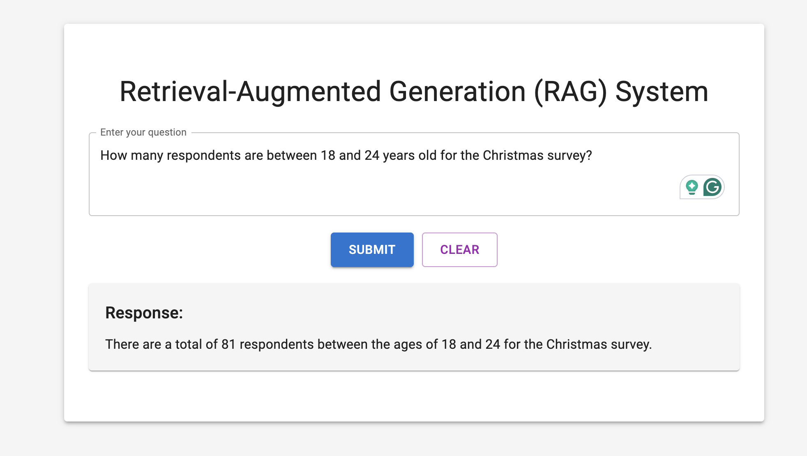
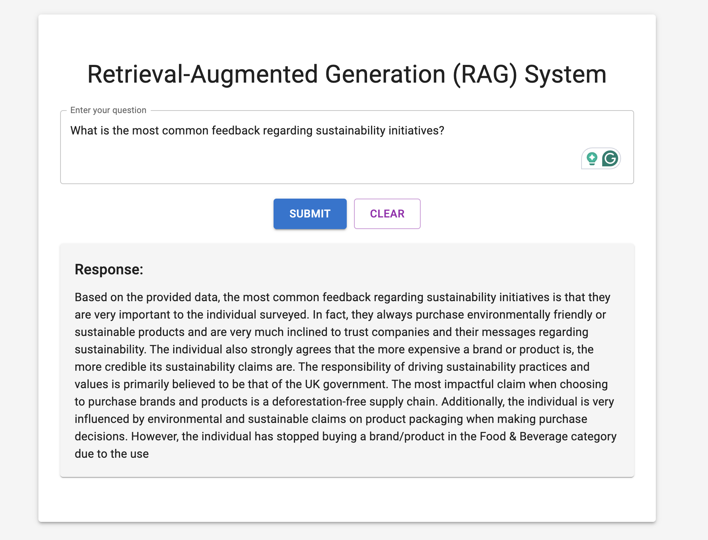
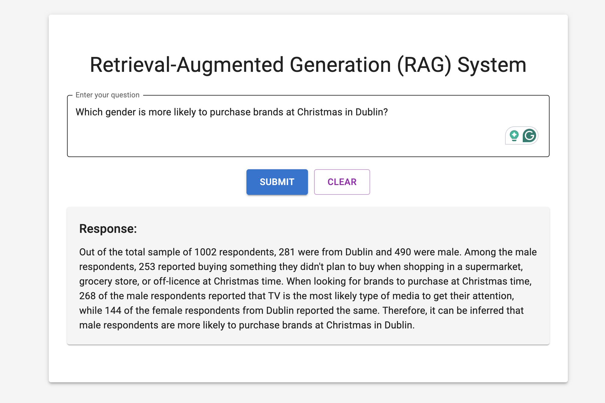

# RAG\_Project

## Overview

The RAG (Retrieval-Augmented Generation) Project is designed to create a web application that integrates backend retrieval mechanisms with a React frontend. The backend provides responses to questions posed by users, utilizing retrieval-augmented generation techniques to ensure more relevant and informed responses. This README file will guide you through setting up, starting, and deploying the project.

## Folder Structure

```
RAG_Project/
|-- backend/
|   |-- __pycache__/
|   |-- .dockerignore
|   |-- .env
|   |-- app.py
|   |-- Data_cleaning.ipynb
|   |-- data_ingestion.py
|   |-- data_llm.py
|   |-- data_retrieval.py
|   |-- data_storage.py
|   |-- Dockerfile
|   |-- requirements.txt
|
|-- Datasets/
|
|-- myenv3.10/
|
|-- rag-frontend/
|   |-- node_modules/
|   |-- public/
|   |-- src/
|   |-- .dockerignore
|   |-- .gitignore
|   |-- Dockerfile
|   |-- nginx.conf
|   |-- package-lock.json
|   |-- package.json
|   |-- README.md
|-- images/
|   |-- question1.png
|   |-- question2.png
|   |-- question3.png
```

## Prerequisites

- **Python 3.10**: Backend is developed in Python.
- **Node.js and npm**: To run the frontend React application.
- **Docker**: Used for containerizing both backend and frontend.
- **Azure CLI**: To deploy and manage the project in Azure.

## Backend Setup

1. **Install Dependencies**

   Navigate to the backend directory and install dependencies using:

   ```sh
   cd backend
   pip install -r requirements.txt
   ```

2. **Environment Variables**

   Set up your `.env` file in the backend folder, specifying keys like Azure Storage Account Access Key, Azure OpenAI Key, and Azure Search Admin Key.

3. **Run the Backend**

   You can run the backend locally by executing:

   ```sh
   uvicorn app:app --reload
   ```

   This will start the backend on `http://127.0.0.1:8000`.

4. **Docker Setup for Backend**

   Build and run the Docker image for the backend:

   ```sh
   docker build -t rag-backend .
   docker run -p 8000:8000 rag-backend
   ```

## Frontend Setup

1. **Install Dependencies**

   Navigate to the `rag-frontend` directory and run:

   ```sh
   cd rag-frontend
   npm install
   ```

2. **Run the Frontend**

   You can run the frontend locally by executing:

   ```sh
   npm start
   ```

   This will start the frontend on `http://localhost:3000`.

3. **Docker Setup for Frontend**

   Build and run the Docker image for the frontend:

   ```sh
   docker build -t rag-frontend .
   docker run -p 80:80 rag-frontend
   ```

## Deployment to Azure

### Backend Deployment

1. **Push Backend Docker Image**

   Use Docker to build and push the image to your Azure Container Registry:

   ```sh
   docker buildx build --platform linux/amd64 -t rag-backend:latest -f backend/Dockerfile ./backend
   docker push <your-acr>.azurecr.io/rag-backend:latest
   ```

2. **Create Azure Web App**

   ```sh
   az webapp create --resource-group <ResourceGroup> --plan <AppServicePlan> --name rag-backend-app --deployment-container-image-name <your-acr>.azurecr.io/rag-backend:latest
   ```

### Frontend Deployment

1. **Push Frontend Docker Image**

   ```sh
   docker buildx build --platform linux/amd64 -t rag-frontend:latest -f rag-frontend/Dockerfile ./rag-frontend
   docker push <your-acr>.azurecr.io/rag-frontend:latest
   ```

2. **Create Azure Web App**

   ```sh
   az webapp create --resource-group <ResourceGroup> --plan <AppServicePlan> --name rag-frontend-app --deployment-container-image-name <your-acr>.azurecr.io/rag-frontend:latest
   ```

## Live Application

The application is deployed and running live at: [RAG Frontend Live](https://rag-frontend-app-bi.azurewebsites.net/)

## Example Usage

### Example Questions and Responses

Here are some snapshots of example questions and their responses to demonstrate the application:

1. **Question:** How many respondents are between 18 and 24 years old for the Christmas survey?
   
   

   - **Response:** There are a total of 81 respondents between the ages of 18 and 24 for the Christmas survey.

2. **Question:** What is the most common feedback regarding sustainability initiatives?
   
   

   - **Response:** Based on the provided survey data, the most common feedback regarding sustainability initiatives is that they are very important to the respondent. Specifically, the respondent from the North East of the UK who identifies as male and aged 18-24 strongly values the sustainability credentials of the brands and products they buy.

3. **Question:** Which gender is more likely to purchase brands at Christmas in Dublin?
   
   

   - **Response:** Out of the total sample of 1002 respondents, 281 were from Dublin and 490 were male. Therefore, it can be inferred that male respondents are more likely to purchase brands at Christmas in Dublin.

These examples illustrate how the backend processes and retrieves relevant information from the datasets.

## Troubleshooting

1. **Port Issues**

   - Ensure the correct port is exposed in Dockerfiles (port `8000` for backend, port `80` for frontend).
   - Update Azure Web App configuration settings if needed, ensuring the ports are set correctly (`WEBSITES_PORT`).

2. **Azure Secrets Detected**

   - Before pushing code to GitHub, make sure sensitive information like API keys are not included.
   - Add `.env` files to `.gitignore` to prevent accidental commits.

3. **Backend or Frontend Failing to Start**

   - Review Azure logs using the Azure portal or CLI to check container errors.
   - Ensure `CORS` is configured correctly in the backend to allow requests from the frontend.
